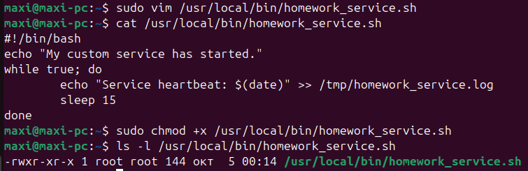
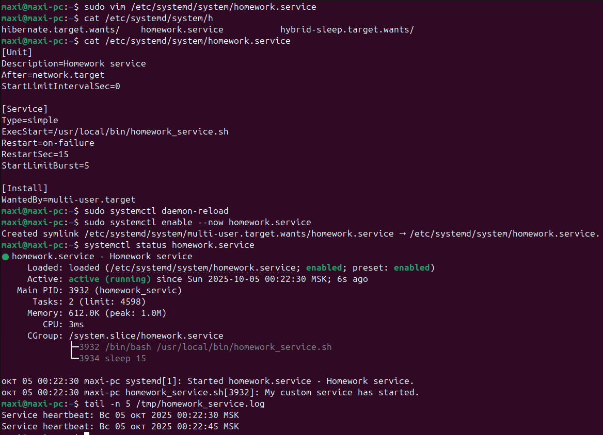
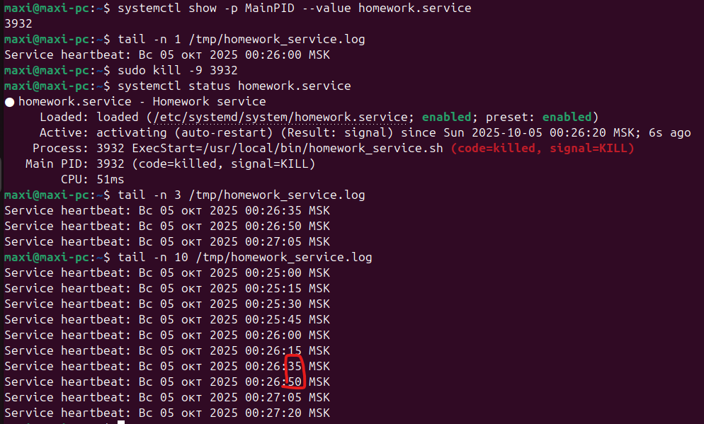
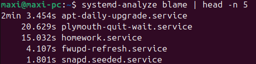
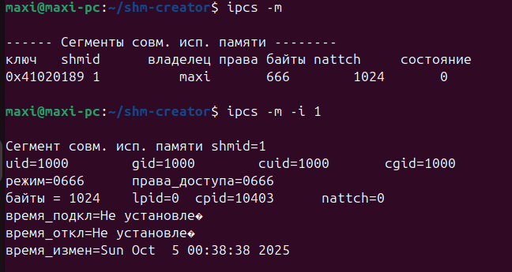
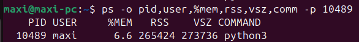
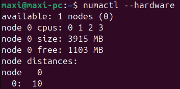
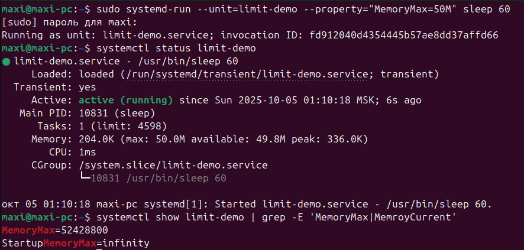
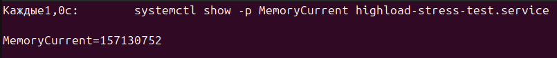
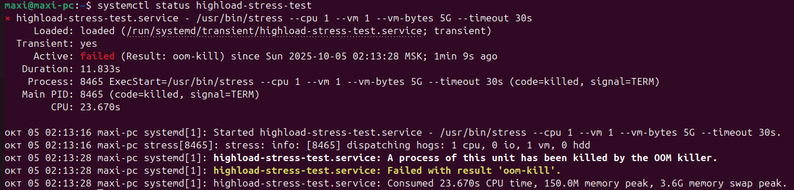

## Выполнение задания 1

Создание файла homework_service.sh и выдача прав на исполнение.



Создание systemd unit-файла для сервиса и демонстрация его работы.



Имитация падения сервиса и результат его автоматического рестарта. Видно, что между 0:26:35 и 0:26:50 сервис был убит и
автоматически перезапущен.



Вывод топ-5 systemd unit-ов, стартующих дольше всего.



---

## Выполнение задания 2

Запуск ```npcs -m``` во время работы программы shm-creator.

Видно сгенерированный ключ, shmid (ID сегмента в таблице ядра), права на чтение/запись, размер
сегмента в байтах.



---

## Выполнение задания 3

Вывод информации об использовании RSS и VSZ.

VSZ - общиё объём виртуально адресованной памяти, RSS - объём страниц, которые фактически загружены в ОЗУ в данный
момент.

VSZ больше, чем RSS, потому что

* адресное пространство содержит участки, которые процесс ещё не трогал
* файловые/библиотечные маппинги считаются в VSZ полностью, но в ОЗУ они не обязательно подгружены полностью

RSS не 0, потому что программа создаёт большую строку. Более того, процесс бы и без строки потреблял память для самого
python.



---

## Выполнение задания 4

На сервере присутствует 1 NUMA-нода на ~4 Гб ОЗУ.



Тестирование ограничений работы процессов через systemd.

Видно, что применилось ограничение на память в 50 Мб.



После запуска стресс-теста с ограничением 150 Мб ОЗУ и запросом 300 Мб ОЗУ видно, что процесс не получил запрашиваемое
количество памяти, но успешно завершился.



При превышении запрашиваемого количества ОЗУ до 5 Гб процесс был убит OOMKiller.



Параметр MemoryMax устанавливает жёсткий предел на потребление ОЗУ сервисом.

Параметр CPUWeight определяет вес при делении процессорного времени между группами (некий приоритет между сервисами на
использование процессора).